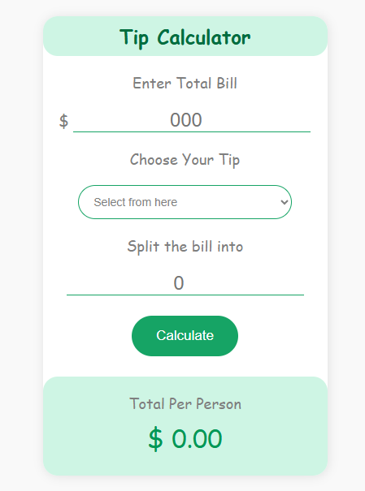

#  Tip Calculator

A simple and intuitive web-based tip calculator that helps you calculate tips and split bills among multiple people. Built with HTML, CSS, and JavaScript.

##  Features

- **Bill Amount Input**: Enter your total bill amount
- **Tip Percentage Selection**: Choose from common tip percentages
- **Bill Splitting tip**: Split the tip among multiple people
- **Real-time Calculation**: Instant results as you input values
- **Responsive Design**: Works on desktop, tablet, and mobile devices
- **Clean UI**: User-friendly interface with clear visual feedback


## 📱 Screenshots



## 🛠️ Technologies Used

- **HTML5**: Structure and layout
- **CSS3**: Styling and responsive design
- **JavaScript**: Interactive functionality and calculations

## 📋 How to Use

1. **Enter Bill Amount**: Input the total amount of your bill
2. **Select Tip Percentage**: Choose how much percentage you want to tip (e.g., 10%, 15%, 20%)
3. **Add Split Number**: Enter how many people are splitting the bill
4. **Get Results**: The calculator will show:
   - Total tip amount divided into one or multiple people

## 🔧 Installation & Setup

1. **Clone the repository**
   ```bash
   git clone https://github.com/Shareef-deen21/tip_calculator
   ```

2. **Navigate to the project directory**
   ```bash
   cd tip-calculator
   ```

3. **Open in your browser**
   - Simply open `index.html` in your web browser
   - Or use a local server like Live Server extension in VS Code

## 📁 Project Structure

```
tip-calculator/
│
├── index.html          # Main HTML file
├── styles.css          # CSS styling
├── script.js           # JavaScript functionality
└── README.md          # Project documentation
```

##  Features in Detail

### Input Validation
- Ensures all inputs are valid numbers
- Prevents negative values
- Handles edge cases gracefully

### Responsive Design
- Mobile-first approach
- Adapts to different screen sizes
- Touch-friendly interface

### User Experience
- Clear labels and instructions
- Immediate visual feedback
- Error handling and validation messages

##  Future Enhancements

- [ ] Save calculation history
- [ ] Multiple currency support
- [ ] Dark/Light theme toggle
- [ ] Export calculations as PDF
- [ ] Preset tip amounts for different service types
- [ ] Group expense tracking
- [ ] QR code sharing for bill splitting


## 👤 Author

**Shareef Deen**
- GitHub: [Shareef-deen21](https://github.com/Shareef-deen21?tab=repositories)
- LinkedIn: [Shareef Deen](https://lk.linkedin.com/in/shareef-deen-69480331a)

## Acknowledgments

- Thanks to the web development community for inspiration
- Icons from [Font Awesome](https://fontawesome.com/) (if used)
- Design inspiration from various tip calculator apps

## Browser Support

- ✅ Chrome 60+
- ✅ Firefox 55+
- ✅ Safari 11+
- ✅ Edge 79+
- ✅ Opera 47+

## 🐛 Known Issues

- None currently reported

---
 **If you found this project helpful, please give it a star on GitHub!** 
